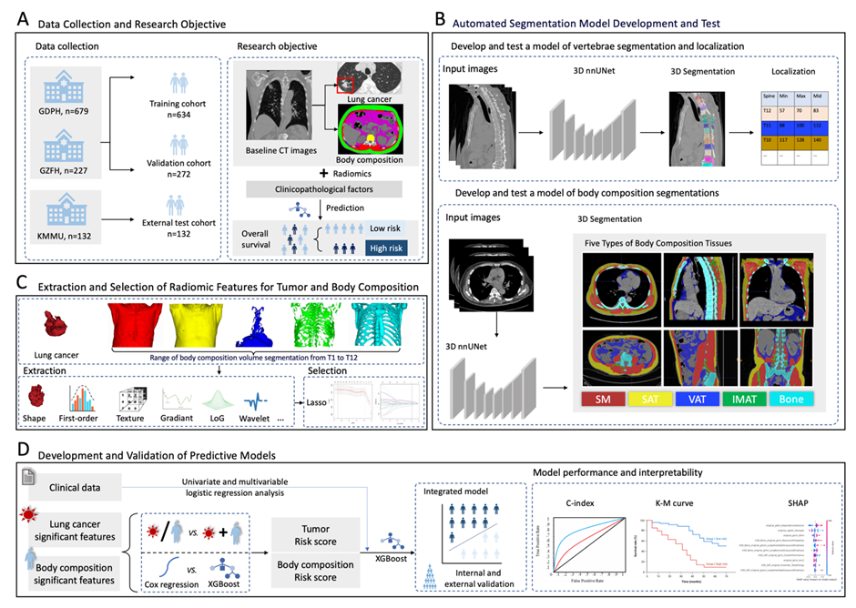

# Interpretable Machine Learning Radiomics Models Integrating Tumor and Automated 3D Body Composition for Survival Prediction in Resectable Non-Small Cell Lung Cancer: A Retrospective Multicenter Study


<hr>




<hr>

## Package dependencies
The project is built with PyTorch 2.0.0, Python3.9.

## Usage
To train spine or body composition segmentation results:
```
python spine_and_body_composition_seg/nnunetv2/run/run_training.py --dataset_name_or_id id 
```
To obtain spine and body composition segmentation results:
```
python spine_and_body_composition_seg/nnunetv2/inference/predict_from_raw_data.py -i /path/to/your/CT/image -o /path/to/output/dir -d dataset_choice
```
To obtain radiomics information:
```
python find_ori_and_get_metrics/fine_spine_and_get_metrics_radiomic.py 
```


## Acknowledgement
This code is inspired by [nnUNet](https://github.com/MIC-DKFZ/nnUNet) and [Comp2Comp](https://github.com/StanfordMIMI/Comp2Comp).

